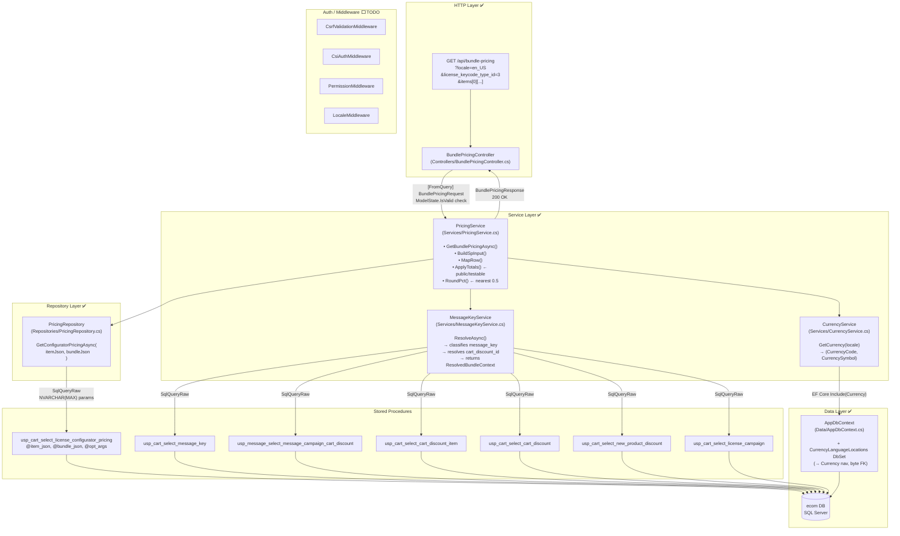

# Bundle Pricing Endpoint — Implementation Guide

**Endpoint:** `GET /api/bundle-pricing` | EF Core 9 · .NET 10 · SQL Server

---

## Implementation Status

```
✅ DONE   GET /api/bundle-pricing — controller, service, repository, message-key, currency
✅ DONE   DTOs — BundlePricingRequest, BundlePricingResponse, ConfiguratorPricingResult
✅ DONE   CurrencyLanguageLocation entity + AppDbContext registration
✅ DONE   PricingRepository — SqlQueryRaw<T> with NVARCHAR(MAX) params
✅ DONE   CurrencyService — locale → (CurrencyCode, CurrencySymbol)
✅ DONE   MessageKeyService — ResolveAsync with all 6 SP calls
✅ DONE   PricingService — orchestration + ApplyTotals math + formatting
✅ DONE   BundlePricingController — 200 / 400 / 422 / 500
✅ DONE   DI registration in Program.cs
✅ DONE   Unit tests — 12 tests, ApplyTotals (LALV 1 / 11 / 12, null equiv_year_price, RoundPct)
✅ DONE   Full test suite green — 75/75

⬜ TODO   Integration test — real SP call with known test keycode (manual / CI gate)
⬜ TODO   Auth middleware pipeline — CSRF, CSI-auth, permission, account-context, locale
            (stubs are in Program.cs — not blocking for this endpoint)
⬜ TODO   POST /cart-orders — next phase (separate endpoint)
⬜ TODO   DB verification queries — run Section 10 against ecom DB after deploy
```

---

## Architecture Flow



---

## 1. HTTP Contract

### Request

```
GET /api/bundle-pricing
```

| Parameter | Type | Required |
|-----------|------|----------|
| `locale` | string | Yes — e.g. `en_US` |
| `license_keycode_type_id` | int | Yes — e.g. `3` |
| `items[0][license_category_name]` | string | Yes — e.g. `SAEP` |
| `items[0][license_seats]` | int | Yes |
| `items[0][years]` | decimal | Yes — e.g. `1` |
| `items[0][message_key]` | UUID string | Conditional |
| `items[0][license_attribute_license_value]` | int | Yes — `1`, `11`, or `12` |
| `items[0][modules][0][license_category_name]` | string | No |
| `items[0][modules][0][license_seats]` | int | No |
| `items[0][modules][0][years]` | decimal | No |

ASP.NET Core binds this nested notation automatically via `[FromQuery]` — no custom binder needed.

### Response — 200 OK

```json
{
  "items": [
    {
      "line_item": 1,
      "quantity": 10,
      "list_price": 30.00,
      "unit_price": 24.50,
      "usage_price": 0.00,
      "equivalent_year_price": 30.00,
      "product_description": "OpenText Core Endpoint Protection 1 Year Renewal",
      "product_type_description": "Renewal",
      "license_category_name": "SAEP",
      "start_date": "2027-04-27 00:00:00.000",
      "expiration_date": "2028-04-27 00:00:00.000",
      "cart_item_bundle_id": 1,
      "item_hierarchy_id": 1,
      "license_attribute_license_value": 1,
      "message_key": "A5A3CD6F-788D-4D20-9E32-3362E88ED732",
      "calculated_discount": 5.50,
      "calculated_discount_pct": 18.0,
      "sub_total_calculated_discount": 55.00,
      "sub_total_list_amount": 300.00,
      "sub_total_amount": 245.00,
      "sub_total_equivalent_year_price": 300.00,
      "estimated_monthly_price": 0.00,
      "list_price_fmt": "$30.00",
      "unit_price_fmt": "$24.50",
      "usage_price_fmt": "$0.00",
      "equivalent_year_price_fmt": "$30.00",
      "calculated_discount_fmt": "$5.50",
      "sub_total_calculated_discount_fmt": "$55.00",
      "sub_total_list_amount_fmt": "$300.00",
      "sub_total_amount_fmt": "$245.00",
      "sub_total_equivalent_year_price_fmt": "$300.00",
      "estimated_monthly_price_fmt": "$0.00"
    }
  ],
  "totals": {
    "sub_total_equivalent_year_price": 300.00,
    "sub_total_list_amount": 300.00,
    "sub_total_amount": 245.00,
    "estimated_monthly_price": 0.00,
    "sub_total_calculated_discount": 55.00,
    "calculated_discount_pct": 18.0,
    "sub_total_amount_fmt": "$245.00"
  },
  "product_totals": {
    "SAEP": { "sub_total_amount": 245.00, "sub_total_amount_fmt": "$245.00" }
  },
  "currency_code": "USD",
  "currency_symbol": "$"
}
```

**Error codes:** `400` invalid params · `422` SP returned no rows · `500` DB failure

> **Note on `calculated_discount_pct`:** Uses `RoundPct()` — rounds to nearest 0.5 via
> `Math.Round(pct * 2, 0, MidpointRounding.AwayFromZero) / 2`. The intermediate
> `discPct` is first computed as `Math.Round(subCalcDisc / subEqYear, 2) * 100`,
> which can cause apparent precision loss before rounding (e.g. 55/300 → 0.18 × 100 = 18 → rounds to 18).

---

## 2. Project Structure (as built)

```
ecom-new-api/
├── Controllers/
│   └── BundlePricingController.cs          ✅
├── Data/
│   ├── AppDbContext.cs                      ✅ + CurrencyLanguageLocations DbSet
│   └── Entities/
│       ├── CurrencyLanguageLocation.cs      ✅ byte FK → Currency.CurrencyId
│       └── ConfiguratorPricingResult.cs     ✅ SqlQueryRaw<T> POCO (not an EF entity)
├── Models/
│   ├── Requests/
│   │   └── BundlePricingRequest.cs          ✅ BundlePricingRequest / BundlePricingItem / BundleModule
│   └── Responses/
│       └── BundlePricingResponse.cs         ✅ BundlePricingResponse / PricingLineItem / PricingTotals
├── Repositories/
│   └── PricingRepository.cs                 ✅ NVARCHAR(MAX) SqlParameters
└── Services/
    ├── IPricingService.cs                   ✅
    ├── PricingService.cs                    ✅ ApplyTotals() + RoundPct() are public (unit-tested)
    ├── MessageKeyService.cs                 ✅ ResolveAsync + 6 SP helpers + SP POCOs
    └── CurrencyService.cs                   ✅ EF Core Include(Currency) lookup

ecom-new-api.Tests/
└── Services/
    └── PricingServiceApplyTotalsTests.cs    ✅ 12 tests — LALV 1/11/12, null equiv_year_price,
                                                           accumulation, RoundPct theory
```

---

## 3. Stored Procedure

**Single SP:** `usp_cart_select_license_configurator_pricing(@item_json, @bundle_json, @opt_args)`

### `@item_json` — `NVARCHAR(MAX)`, JSON array

```json
[
  {
    "license_category_name": "SAEP",
    "license_seats": 10,
    "storage_gb": null,
    "retention_model_id": null,
    "years": 1.0,
    "license_keycode_type_id": 3,
    "locale": "en_US",
    "license_attribute_license_value": 1,
    "start_date": "",
    "expiration_date": "",
    "cart_item_bundle_id": 1,
    "item_hierarchy_id": 1,
    "vendor_order_item_code": null,
    "discount": null,
    "cart_discount_method_id": null
  }
]
```

- Primary: `item_hierarchy_id = 1` · Module: `item_hierarchy_id = 2`
- `start_date` / `expiration_date`: always pass `""` (empty string) — **never** JSON `null`. The SP converts `""` to NULL internally.
- Serialized using `JsonNamingPolicy.SnakeCaseLower` + `WhenWritingNull` inside `PricingService`

### `@bundle_json` — `NVARCHAR(MAX)`, JSON object

```json
{
  "locale": "en_US",
  "keycode": "0116ENTPCC6E584F4771",
  "license_attribute_license_value": 1,
  "license_keycode_type_id": 3,
  "message_key": "A5A3CD6F-...",
  "cart_discount_id": null,
  "message_campaign_name": null
}
```

- `message_key` only included when `ResolvedBundleContext.IncludeMessageKeyInBundle == true`
- `cart_discount_id` populated by `MessageKeyService.ResolveAsync()` before the SP call

### SP Output → `ConfiguratorPricingResult`

| Column | C# Type | Note |
|--------|---------|------|
| `line_item`, `quantity` | `int` | |
| `list_price`, `unit_price`, `usage_price` | `decimal` | |
| `equivalent_year_price` | `decimal?` | **NULL → fall back to `list_price` in `MapRow()`** |
| `product_description`, `product_type_description` | `string` | |
| `license_category_name` | `string` | **Row skipped if null/empty** |
| `license_category_description` | `string?` | Falls back to `""` |
| `start_date`, `expiration_date` | `DateTime?` | Formatted as `"yyyy-MM-dd HH:mm:ss.fff"` in response |
| `cart_item_bundle_id`, `item_hierarchy_id` | `int` | |
| `order_item_offer_amount`, `product_family_description` | `string?` | |
| `license_keycode_type_id`, `dependent_cart_order_item_id` | `int?` | |

> Sub-totals, discounts, and formatted prices are **not** returned by the SP — all computed in `PricingService.ApplyTotals()`.

---

## 4. EF Core Setup

### `AppDbContext` additions

```csharp
// Currency / site tables
public DbSet<CurrencyLanguageLocation> CurrencyLanguageLocations => Set<CurrencyLanguageLocation>();

// OnModelCreating — currency_language_location → currency (many..1)
modelBuilder.Entity<CurrencyLanguageLocation>()
    .HasOne(cll => cll.Currency)
    .WithMany()
    .HasForeignKey(cll => cll.CurrencyId);  // byte FK — must match Currency.CurrencyId (byte PK)
```

### `CurrencyLanguageLocation` entity

```csharp
[Table("currency_language_location")]
public class CurrencyLanguageLocation
{
    [Key] public int  CurrencyLanguageLocationId { get; set; }
    public string     LanguageCode { get; set; }   // e.g. "en"
    public string     LocationCode { get; set; }   // ISO3, e.g. "USA"
    public byte       CurrencyId   { get; set; }   // byte — matches Currency PK
    public Currency?  Currency     { get; set; }   // navigation
}
```

> ⚠️ **`CurrencyId` must be `byte`** (not `int`) — `Currency.CurrencyId` is `byte`. A type mismatch causes EF model validation to fail at runtime.

`ConfiguratorPricingResult` and all `MessageKeyService` SP POCOs are **not** registered in `AppDbContext` — `Database.SqlQueryRaw<T>` accepts any unregistered POCO in EF Core 7+.

---

## 5. Services

### `MessageKeyService` — `ResolveAsync` algorithm

```
Input: BundlePricingItem bundle, string locale
Output: ResolvedBundleContext { Bundle, Keycode?, CartDiscountId?, MessageCampaignName?, IncludeMessageKeyInBundle }

1. No message_key → drop key, run site-discount fallback (SP6)

2. Numeric message_key →
   ClassifyKey (SP2) →
     "zuora_campaign_id" → IncludeMessageKeyInBundle=true, return
     else → drop key, run site-discount fallback

3. UUID message_key →
   ClassifyKey (SP2) →
     "license_key" / "zuora_license_key" →
       GetKeycode (SP2) → GetCampaignName (SP7) → IncludeMessageKeyInBundle=true, return
     "cart_discount_key" →
       Deserialize MessageKeyJson → VerifyDiscount (SP4) →
         valid → CartDiscountId set, return
     unmatched →
       GetDiscountByCampaign specific (SP3) → if found GetDiscountKey (SP5) → CartDiscountId set, return
       GetDiscountByCampaign generic  (SP3) → if found GetDiscountKey (SP5) → CartDiscountId set, return

4. Fallback → GetSiteDiscount (SP6) → CartDiscountId set if found
```

### SP calls by `MessageKeyService`

| Method | SP | Key params |
|--------|----|------------|
| `ClassifyKeyAsync` | `usp_cart_select_message_key` | `@message_key`, `@license_category_name`, `@years`, `@seats` |
| `GetKeycodeAsync` | `usp_cart_select_message_key` | `@message_key` |
| `GetCampaignNameAsync` | `usp_cart_select_license_campaign` | `@keycode` |
| `VerifyDiscountAsync` | `usp_cart_select_cart_discount_item` | `@cart_discount_id` |
| `GetDiscountByCampaignAsync` | `usp_message_select_message_campaign_cart_discount` | `@message_campaign_key`, `@license_category_name?`, `@license_seats?` |
| `GetDiscountKeyAsync` | `usp_cart_select_cart_discount` | `@cart_discount_id` |
| `GetSiteDiscountAsync` | `usp_cart_select_new_product_discount` | `@license_category_name`, `@license_seats`, `@years`, `@language_code`, `@location_code`, `@cart_discount_method_id=NULL`, `@discount=NULL` |

### `PricingService.ApplyTotals` — math

```
subEqYear = Round(equivalentYearPrice × qty, 2)
subList   = Round(listPrice × qty, 2)
subUnit   = Round(unitPrice × qty, 2)
subUsage  = Round(usagePrice × qty, 2)

if equivalentYearPrice > unitPrice:
    calcDisc    = Round(equivalentYearPrice - unitPrice, 2)
    subCalcDisc = Round(subEqYear - subUnit, 2)
    discPct     = Round(subCalcDisc / subEqYear, 2) × 100

CalculatedDiscountPct = RoundPct(discPct)   // nearest 0.5
```

---

## 6. DI Registration (`Program.cs`)

```csharp
// Repositories
builder.Services.AddScoped<ICartOrderRepository, CartOrderRepository>();
builder.Services.AddScoped<PricingRepository>();

// Services
builder.Services.AddScoped<ICartOrderService, CartOrderService>();
builder.Services.AddScoped<CurrencyService>();
builder.Services.AddScoped<MessageKeyService>();
builder.Services.AddScoped<IPricingService, PricingService>();
```

JSON serialisation (HTTP response) uses the project-wide `SnakeCaseNamingPolicy.Instance` — already configured in `AddControllers().AddJsonOptions(...)`.

---

## 7. Business Rules (implemented)

| Rule | Where enforced |
|------|---------------|
| **LALV=1 Annual** | `unit_price` used; `usage_price=0` |
| **LALV=11 Overage** | Both `unit_price` and `usage_price` have values |
| **LALV=12 Utility** | `unit_price=0`; `usage_price` carries the value |
| **`equivalent_year_price` NULL** | Fallback to `list_price` in `MapRow()` |
| **Discount % rounding** | `RoundPct()` — nearest 0.5 |
| **Skip SP rows** | `if (string.IsNullOrEmpty(row.LicenseCategoryName)) continue;` |
| **SP JSON serialization** | `JsonNamingPolicy.SnakeCaseLower` + `WhenWritingNull`; `start_date`/`expiration_date` = `""` |
| **HTTP response serialization** | `SnakeCaseNamingPolicy.Instance` globally in `Program.cs` |

---

## 8. Unit Tests

**File:** `ecom-new-api.Tests/Services/PricingServiceApplyTotalsTests.cs`

| Test | Covers |
|------|--------|
| `Lalv1_Annual_SetsSubTotalsCorrectly` | Qty×price math, calcDisc, subCalcDisc, discPct |
| `Lalv1_Annual_FormatsUsdCorrectly` | `"C"` format via `CultureInfo.CreateSpecificCulture` |
| `Lalv11_Overage_BothUnitAndUsagePriceSet` | Usage price accumulation |
| `Lalv12_Utility_UnitPriceZeroUsagePriceSet` | Zero unit price, non-zero usage |
| `NullEquivalentYearPrice_FallsBackToListPrice` | MapRow fallback applied before ApplyTotals |
| `BundleTotals_AccumulateAcrossMultipleLines` | Multi-line bundle accumulation |
| `RoundPct_RoundsToNearestHalf` (×6 theory) | 18.3→18.5, 18.6→18.5, 18.75→19, 0→0, 100→100 |

---

## 9. What Remains

### ⬜ Integration test

Real SP smoke test with a known test keycode (matches Section 10 of the original guide):

```csharp
// Suggested: ecom-new-api.Tests/Integration/BundlePricingIntegrationTests.cs
// Requires: appsettings.Test.json with real EcomDb connection string
// Call PricingRepository.GetConfiguratorPricingAsync directly, assert row count > 0
```

### ⬜ Auth middleware pipeline

These stubs are already in `Program.cs` as TODOs:

```
CsrfValidationMiddleware   → X-WRCART-CSRF header check (non-GET only)
CsiAuthMiddleware          → X-CSI-USER / X-CSI-USER-ID → 401
PermissionMiddleware       → cart_order.create permission → 403
AccountContextMiddleware   → injects username, csi_user_id, p_rc, trx_rc
LocaleMiddleware           → X-CSI-LOCALE header → sets request.Locale
```

The `BundlePricingController` has a `[FromQuery]` `Locale` parameter that the `LocaleMiddleware` would eventually populate. Until middleware is wired, `locale` must be passed explicitly by the client.

### ⬜ DB verification (manual — run after deploy)

```sql
-- Confirm currency_language_location is queryable
SELECT language_code, location_code, c.currency_code
FROM currency_language_location cll
INNER JOIN currency c ON c.currency_id = cll.currency_id
ORDER BY language_code, location_code;

-- Smoke-test pricing SP (no keycode)
EXEC usp_cart_select_license_configurator_pricing
  @item_json   = N'[{"license_category_name":"SAEP","license_seats":10,"years":1,
    "license_keycode_type_id":3,"locale":"en_US","license_attribute_license_value":1,
    "start_date":"","expiration_date":"","cart_item_bundle_id":1,"item_hierarchy_id":1}]',
  @bundle_json = N'{"locale":"en_US","license_attribute_license_value":1,"license_keycode_type_id":3}',
  @opt_args    = NULL;
```

---

## 10. Implementation Checklist

- [x] DTOs: `BundlePricingRequest`, `BundlePricingResponse`, `ConfiguratorPricingResult`
- [x] `CurrencyLanguageLocation` entity + `AppDbContext` DbSet + FK model config (`byte`)
- [x] `PricingRepository` — `GetConfiguratorPricingAsync` via `Database.SqlQueryRaw<T>` with explicit `NVARCHAR(MAX)` params
- [x] `CurrencyService` — locale → currency via EF Core `Include(Currency)` lookup
- [x] `MessageKeyService` — `ResolveAsync` with all 6 SP calls and full classification logic
- [x] `IPricingService` interface
- [x] `PricingService` — orchestration + `ApplyTotals` math + `RoundPct` + currency formatting
- [x] `BundlePricingController` — `GET /api/bundle-pricing` with 400 / 422 / 500 handling
- [x] DI registration in `Program.cs`
- [x] Unit tests — 12 tests, all passing; full suite 75/75 green
- [ ] Integration test — real SP call with known test keycode
- [ ] Auth middleware pipeline wired up
- [ ] DB verification queries run against ecom DB post-deploy

